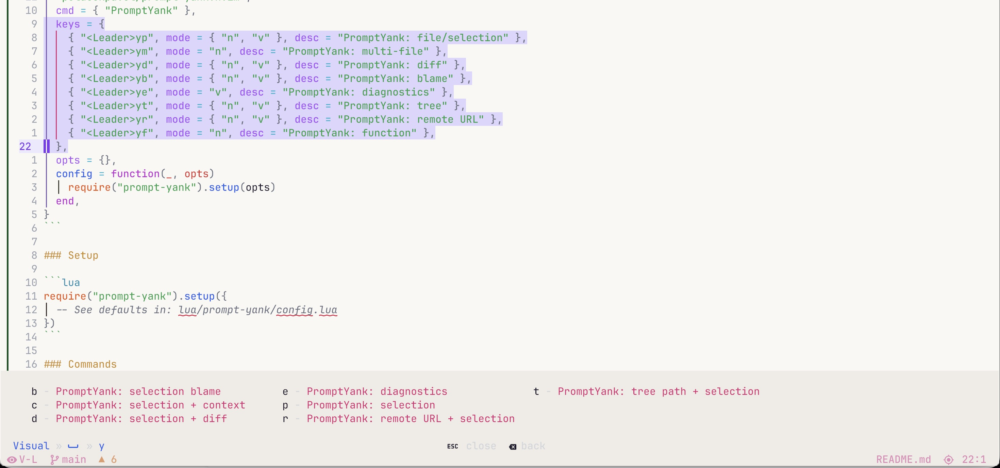
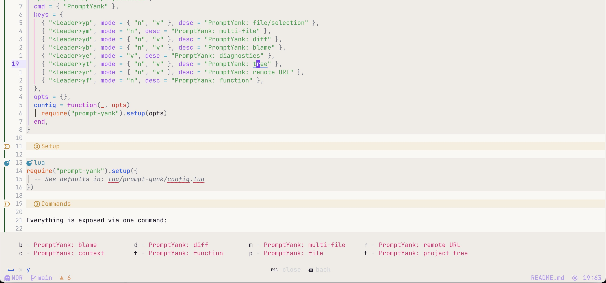
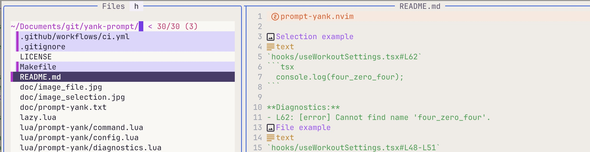

## prompt-yank.nvim

Copy code with rich context (file paths, line numbers, language detection) formatted for pasting into LLM prompts.

Think of it as a **Copy for AI** button in Neovim.



````text
`hooks/useWorkoutSettings.tsx#L62`
```tsx
  console.log(four_zero_four);
```

**Diagnostics:**
- L62: [error] Cannot find name 'four_zero_four'.
````



````text
`hooks/useWorkoutSettings.tsx#L48-L51`
```tsx
  } catch (error) {
    console.error("Error ensuring profile exists:", error);
    return false;
  }
```
````



### Install (lazy.nvim)

```lua
{
  "polacekpavel/prompt-yank.nvim",
  cmd = { "PromptYank" },
  keys = {
    { "<Leader>yp", mode = { "n", "v" }, desc = "PromptYank: file/selection" },
    { "<Leader>ym", mode = "n", desc = "PromptYank: multi-file" },
    { "<Leader>yd", mode = { "n", "v" }, desc = "PromptYank: diff" },
    { "<Leader>yb", mode = { "n", "v" }, desc = "PromptYank: blame" },
    { "<Leader>ye", mode = "v", desc = "PromptYank: diagnostics" },
    { "<Leader>yt", mode = { "n", "v" }, desc = "PromptYank: tree" },
    { "<Leader>yr", mode = { "n", "v" }, desc = "PromptYank: remote URL" },
    { "<Leader>yf", mode = "n", desc = "PromptYank: function" },
    { "<Leader>yl", mode = "v", desc = "PromptYank: selection + definitions" },
    { "<Leader>yL", mode = "v", desc = "PromptYank: selection + deep definitions" },
    { "<Leader>yR", mode = "n", desc = "PromptYank: related files" },
  },
  opts = {},
  config = function(_, opts)
    require("prompt-yank").setup(opts)
  end,
}
```

### Setup

```lua
require("prompt-yank").setup({
  -- See defaults in: lua/prompt-yank/config.lua
})
```

### Output Style

By default, output uses **Markdown** fenced code blocks (optimized for OpenAI / ChatGPT).
Set `output_style = "xml"` to use **XML tags** (preferred by Claude / Anthropic models).

Claude and other Anthropic models parse structured context more reliably when it is wrapped
in XML tags rather than Markdown fences. XML gives the model unambiguous boundaries between
file metadata, code, and diagnostics — reducing hallucinated line numbers and misattributed
snippets in longer prompts. If you mainly paste into Claude, switching to XML is recommended.

You can also switch at runtime without restarting Neovim:

```vim
:PromptYank style xml
:PromptYank style markdown
```

```lua
require("prompt-yank").setup({
  output_style = "xml", -- "markdown" (default) or "xml"
})
```

**Markdown** (default):

````text
`src/main.lua#L10-L20`
```lua
-- code here
```
````

**XML**:

```text
<file path="src/main.lua" lines="10-20" language="lua">
-- code here
</file>
```

#### Full example: diagnostics with XML style

```text
<file path="app/swift-example/Views/Sensors/SensorsView.swift" lines="17-20" language="swift">
struct SensorRowView: View {
    let sensorType: SensorType
    let status: SensorRowStatus
    let onTap: (() -> Void)?
</file>
<diagnostics>
- L18: [error] Cannot find type 'SensorType' in scope
</diagnostics>
```

The `output_style` setting controls both the code block format and all surrounding templates
(diagnostics, diffs, blame, tree, definitions, etc.). When set to `"xml"`, the default
code format switches to `xml` automatically. You can still override `format` independently:

```lua
require("prompt-yank").setup({
  output_style = "xml",   -- XML templates for diagnostics, diff, blame, etc.
  format = "claude",      -- use the claude code block format specifically
})
```

Both `templates` and `xml_templates` tables are user-configurable. Custom entries in
`xml_templates` override the defaults when `output_style = "xml"`.

#### Code Block Formats

There are 4 built-in formats that control how individual code blocks are wrapped.
Switch with `:PromptYank format <name>` or set `format` in `setup()`.

| Format    | Output                                                                    |
|-----------|---------------------------------------------------------------------------|
| `default` | `` `path#L1-L5` ```lang ... ``` ``                                        |
| `minimal` | `` ```lang ... ``` <!-- path#L1-L5 --> ``                                 |
| `xml`     | `<file path="..." lines="..." language="..."> code </file>`               |
| `claude`  | `<file path="..." lines="..." language="..."><code> code </code></file>`  |

The `xml` and `claude` formats are both XML-based — the only difference is that `claude`
wraps the code in an additional `<code>` tag inside `<file>`.

### Commands

Everything is exposed via one command:

- `:PromptYank` (smart: range → selection, no range → file)
- `:PromptYank file|selection|function|multi|diff|blame|diagnostics|context|tree|remote|definitions|definitions_deep|related`
- `:PromptYank format [name]`
- `:PromptYank formats`
- `:PromptYank style [markdown|xml]`

### Checkhealth

Run:

- `:checkhealth prompt-yank`

### Default Keymaps

Set on `setup()` (disable with `keymaps = false`):

Normal mode:
- `<Leader>yp` copy file
- `<Leader>yf` copy function
- `<Leader>ym` copy multiple files
- `<Leader>yd` copy diff (current file)
- `<Leader>yb` copy blame (current file)
- `<Leader>yt` copy project tree
- `<Leader>yr` copy remote URL + code
- `<Leader>yR` copy related files (smart context slice)

Visual mode:
- `<Leader>yp` copy selection
- `<Leader>ye` copy diagnostics
- `<Leader>yd` copy selection + diff
- `<Leader>yb` copy selection blame
- `<Leader>yt` copy tree path + selection
- `<Leader>yl` copy selection + LSP definitions
- `<Leader>yL` copy selection + deep LSP definitions (recursive)

### Output Example

````text
`src/main.lua#L10-L20`
```lua
-- code here
```
````

### LSP Definitions

Copy code with all referenced symbols (functions, types, interfaces, variables) resolved via LSP:

- **`<Leader>yl`** — selection + direct definitions (one level)
- **`<Leader>yL`** — selection + deep definitions (recursive, up to 3 levels)

Each definition includes file path and line numbers for full context.

#### Example Output

Select this code in `app/profile.tsx`:
```tsx
const user = useCurrentUser();
return <ProfileCard user={user} />;
```

Running `<Leader>yl` produces:

````text
`app/profile.tsx#L10-L11`
```tsx
const user = useCurrentUser();
return <ProfileCard user={user} />;
```

---

**Referenced Definitions:**

`hooks/useCurrentUser.ts#L5-L15` (definition: useCurrentUser)
```typescript
export function useCurrentUser(): User {
  const { data } = useQuery(['user'], fetchUser);
  return data;
}
```

`components/ProfileCard.tsx#L8-L25` (definition: ProfileCard)
```tsx
export function ProfileCard({ user }: { user: User }) {
  return (
    <div className="card">
      <h2>{user.name}</h2>
    </div>
  );
}
```
````

#### Options (via API)

- `timeout_ms` — LSP request timeout (default: 2000ms)
- `max_depth` — recursion depth for deep version (default: 3)
- `max_definitions` — cap on total definitions (default: 50)

### Related Context

Copy the current file together with its related files — a smart slice through your codebase
tailored for LLM context. Instead of manually picking which files to include, `related`
automatically discovers dependencies via **Tree-sitter import analysis** and
**LSP references**, then bundles them into a single clipboard payload.

This gives the LLM a focused, relevant cross-section of your project without dumping the
entire repo.

- **`<Leader>yR`** — copy current file + related files

How files are discovered:

1. **Imports** — Tree-sitter parses `require()` (Lua), `import` (JS/TS), and `from` (Python)
   statements, then resolves them to real files within the project.
2. **LSP references** — document symbols are queried for cross-file references, surfacing
   files that use or are used by the current file.
3. Results are deduplicated, capped at `max_files` (default 10), and sensitive files are
   automatically skipped.

#### Configuration

```lua
require("prompt-yank").setup({
  related = {
    max_files = 10, -- maximum number of related files to include
  },
})
```

### Notes

- No required dependencies (pure Lua).
- Git features require `git` available on `$PATH`.
- LSP definitions require an active LSP client attached to the buffer.
- Multi-file picker prefers `fzf-lua`, then `telescope`, then a builtin input fallback.

### Development

- `make lint` checks formatting.
- `make test` runs headless tests and requires Plenary.
- Provide Plenary with `make deps` or set `PLENARY_DIR` to an existing checkout.

### Security / Safety

- All git invocations use list-form `vim.fn.system({ ... })` (no shell parsing).
- `:PromptYank remote` strips embedded credentials from HTTPS remotes (e.g. `https://token@…`); prefer SSH or credential helpers instead of storing tokens in remotes.
- With `path_style="relative"`, output never includes absolute local paths (files outside the root fall back to `:.'` style paths like `../…`).
- Git/tree features refuse to generate repo context for files outside the detected project root (prevents bogus URLs / absolute-path trees).
- Multi-file yank skips common sensitive files by default and will not copy files outside the detected project root.
- Large files/diffs prompt for confirmation before copying.
